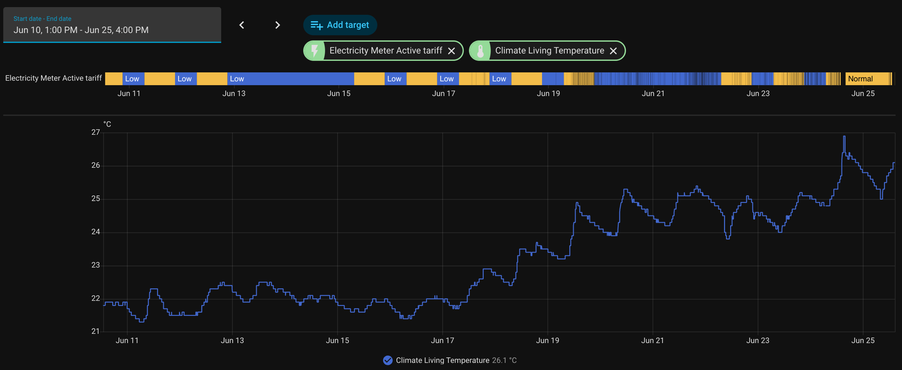

# P1 Smart Meter Reader Corruption - Diagnosis (2026-06-25)

## Symptom

Home Assistant DSMR (smart meter) sensor stopped working. HA logs filled with:

```
ERROR (MainThread) [dsmr_parser.clients.protocol] disconnected due to exception
UnicodeDecodeError: 'ascii' codec can't decode byte 0xc1 in position 10: ordinal not in range(128)
```

The byte and position changed every telegram (`0xc1`@10, `0xb3`@81, `0xb0`@934, ...). The
DSMR parser drops the whole connection on the first bad byte, so the sensor went fully dead.

## Setup

- **Reader:** "Slimme Lezer" = Hi-Flying **E20** serial-to-ethernet bridge, firmware `1.40.2`
  (web build `2210111647069072`, dated 2022-10-11), at `192.168.1.130`.
- Reads the meter's **P1 port** (DSMR 5.0, `1-3:0.2.8(50)`) over serial, exposes raw
  telegrams over **TELNETD on port 23**.
- HA connects via the DSMR integration and parses the telegrams.

## The signature (this is the whole diagnosis)

Captured the raw telnet stream, bypassing HA, and counted every byte > 0x7f:

```
total bytes: ~13800   high-bit bytes: 14   <- all in the data, none random
```

Every single corrupt byte was a **valid P1 character with bit 7 (0x80) set**:

| corrupt | = ASCII | char |
|---------|---------|------|
| 0xb0    | 0x30    | `0`  |
| 0xb8    | 0x38    | `8`  |
| 0xd6    | 0x56    | `V`  |
| 0xa9    | 0x29    | `)`  |
| 0xd7    | 0x57    | `W`  |
| 0xc2    | 0x42    | `B`  |

**Zero** bytes were anything other than "clean char + 0x80". That is the key fact.

### Why bit-7-only points at clock/timing drift

UART transmits LSB-first: `start, b0..b7, stop`, with the stop bit held **high (1)**.
Bit 7 is the **last data bit** before the stop bit. If the receiver's sample clock drifts
late (baud/oscillator mismatch), the cumulative timing error is **largest at the end of the
byte** - the bit-7 sample slides into the high stop-bit region and reads `1`. Result:
the MSB gets set on otherwise-correct characters. Exactly the observed pattern.

With parity `NONE`, the UART has nothing to verify and the real stop bit still reads high, so
**no framing/parity error is ever flagged** - the reader silently forwards garbage. This is why
the E20's "Failed Bytes / Failed Frames" counters both showed **0** while it was corrupting data.

## What was ruled out (with evidence)

| Hypothesis | Verdict | Evidence |
|---|---|---|
| Smart-meter firmware upgrade | Ruled out | Corruption is random-position, bit-7-only, worsening over time. Firmware bugs are systematic. P1/DSMR 5.0 output is frozen ASCII, utility-controlled. |
| Reader firmware | Ruled out | Firmware is 3.5 years old (2022-10), no auto-update. |
| Serial config drift (baud/parity) | Ruled out | Web UI confirmed `115200,8,1,NONE` = correct 115200 8N1 for DSMR 5.0. |
| HA / `dsmr_parser` / py3.14 bug | Ruled out | Bad bytes present in the raw TCP stream *before* HA touches it. The strict `encode("latin1").decode("ascii")` is a parser fragility, but not the cause. |
| **Reader oscillator thermal drift** | **Confirmed** | See test below. |

## The confirming test (fan)

E20 TELNETD only streams **after the client answers the telnet IAC negotiation** (plain `nc`
never replies, so it only gets the 15-byte greeting - had to use a Python client that responds
DONT/WONT). Measured corrupt-bytes-per-telegram before and after pointing a fan at the unit:

> During diagnosis I wrongly assumed the E20 was single-client and went through disabling the
> HA integration + rebooting the E20 to "free the socket". That was unnecessary - see the
> multi-client correction in Notes below. The fan measurements stand regardless.

| condition | telegrams | corrupt bytes | per telegram |
|---|---|---|---|
| baseline (hot, no fan) | 86 | 277 | **3.22** |
| fan +3 min | 61 | 0 | **0.00** |
| fan +7 min | 61 | 0 | **0.00** |
| fan +12 min | 61 | 0 | **0.00** |

Corruption collapsed from 3.22/telegram to **exactly zero within 3 minutes** of airflow and
stayed there. Binary, unambiguous.

## Corroborating evidence (historical, HA data)

Overlaying the **tariff sensor** (`0-0:96.14.0`, top) against **living-room temperature**
(bottom) for Jun 10-25 shows the same story in historical data, independent of the fan test:




- **Tariff sensor:** clean alternating Low/Normal day-night bands through ~Jun 17-18, then
  collapses into a dense flicker from ~**Jun 19** onward - corrupted/dropped telegrams producing
  erratic tariff values. This marks the corruption *onset*.
- **Temperature:** flat at ~22 C from Jun 10-17, then climbs from ~Jun 18-19 to 24-25 C, reaching
  26-27 C by Jun 25.

The two line up: the sensor goes haywire exactly as the temperature crosses ~24 C around
Jun 18-19. Cool period = clean telegrams, warm period = corruption. This confirms the thermal
root cause from history, before the fan test was run.

> Caveat: living-room temperature is a **proxy** for the meter-cupboard / ambient temperature,
> not a direct measurement at the E20. But the trend direction and onset timing match, so the
> correlation holds directionally.

## Root cause

The E20's **clock oscillator has aged to a temperature-marginal state**. When the meter cupboard
warms (June onset), the oscillator drifts enough that bit-7 sampling fails. Cool it and timing
recovers. Explains why a setup untouched for months broke "suddenly."

## Resolution

- **Immediate:** fan on the E20 restores correct output. Re-enable the HA DSMR integration; it
  reconnects and parses clean telegrams. (Fan is a thermometer-that-cools, not a real fix.)
- **Permanent:** **replace the reader.** Oscillator aging is one-way; it will return with the
  next warm spell. A new P1 reader (~EUR 30) ends it. Prefer a **USB-P1 cable** or **ESPHome P1
  dongle** over the telnet bridge - simpler, no IAC-negotiation quirk, and avoids the flaky module.

## Notes / gotchas for next time

- **E20 TELNETD is multi-client (verified).** Opening two concurrent negotiated connections, with
  HA also connected, all received identical full telegram streams - no starvation. You can capture
  alongside HA without disabling the integration. (Initial single-client assumption was wrong; it
  came from misreading the IAC symptom below.)
- **You must answer the telnet IAC negotiation** or the E20 sends only the greeting (~15 bytes) and
  no data. This - not a client-slot limit - is why plain `nc` returned nothing useful. Use a client
  that replies DONT/WONT. Capture/measure scripts lived in `/tmp` (`p1measure.py`) during
  diagnosis - not committed.
- The bit-7-only test is the fast discriminator: if smart-meter data corrupts and **every** bad
  byte is `good_char | 0x80`, suspect serial timing/oscillator, not firmware or config.
